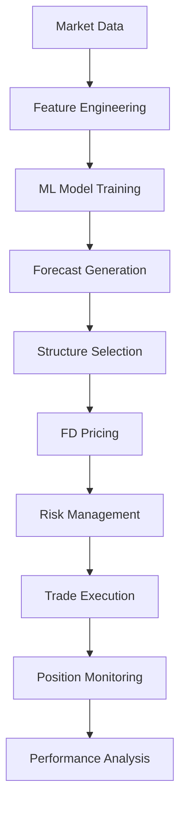

# Options Trading Strategy - Complete User Guide

## Table of Contents

1. [Overview](#overview)
2. [Installation and Setup](#installation-and-setup)
3. [Strategy Execution Flow](#strategy-execution-flow)
4. [Configuration Guide](#configuration-guide)
5. [Data Requirements](#data-requirements)
6. [Running the Strategy](#running-the-strategy)
7. [Interpreting Results](#interpreting-results)
8. [Live Data Integration](#live-data-integration)
9. [Production Deployment](#production-deployment)
10. [Troubleshooting](#troubleshooting)

## Overview

The Options Trading Strategy is a sophisticated ML-driven system that combines:

- **Machine Learning Forecasting** (P-measure): Predicts market direction and volatility
- **Finite Difference Pricing** (Q-measure): Accurate option pricing using PDE solvers
- **Risk Management**: Kelly sizing and comprehensive risk controls
- **Realistic Execution**: Includes costs, slippage, and market impact

The strategy trades **bull call spreads** and **bear put spreads** based on ML forecasts, using your custom-built Crank-Nicolson and Rannacher FD solvers for accurate pricing.

## Installation and Setup

### 1. Install Dependencies

```bash
# Install with UV (recommended)
uv pip install -e ".[strategy]"

# Or with regular pip
pip install -e .[strategy]
```

### 2. Verify Installation

```python
# Test the installation
python -c "
from strategy import StrategyConfig, FeatureBuilder, GBTForecaster
from pde import BlackScholesCNSolver, BlackScholesCNRannacherSolver
print('✅ Strategy framework installed successfully!')
"
```

### 3. Create Configuration

```bash
# Copy the default configuration
cp config/strategy_config.yaml config/my_strategy.yaml

# Edit as needed
nano config/my_strategy.yaml
```

## Strategy Execution Flow

### Complete Strategy Pipeline



### Detailed Step-by-Step Process

#### Step 1: Data Ingestion
```python
# Load market data
market_data = {
    'prices': price_data,      # OHLCV data
    'options': options_data,   # Options chain
    'vix': vix_data,          # VIX data
    'rates': rates_data,      # Interest rates
    'credit': credit_data     # Credit spreads
}
```

#### Step 2: Feature Engineering
```python
from strategy import FeatureBuilder

feature_builder = FeatureBuilder(config)
feature_set = feature_builder.build_features(**market_data)

# Features include:
# - Price features (returns, gaps, momentum)
# - Volatility features (RV, jumps, regimes)
# - IV surface features (level, skew, term structure)
# - Cross-asset features (VIX, rates, credit)
# - Volume and liquidity features
# - Regime indicators
```

#### Step 3: Model Training
```python
from strategy import GBTForecaster

forecaster = GBTForecaster(config)
model_results = forecaster.train(
    X=feature_set.features,
    y=feature_set.target_direction
)

# Cross-validation
cv_results = forecaster.cross_validate(
    X=feature_set.features,
    y=feature_set.target_direction
)
```

#### Step 4: Forecast Generation
```python
# Generate forecasts
forecast = forecaster.get_forecast(features)

# Forecast contains:
# - expected_returns: Expected price movement
# - probabilities: Probability of positive return
# - confidence: Forecast confidence level
```

#### Step 5: Structure Selection
```python
from strategy import OptionStructureSelector

selector = OptionStructureSelector(config)
selection = selector.select_structure(
    forecast=forecast,
    market_data=market_data,
    current_price=current_price,
    current_time=current_time
)

# Selection logic:
# - Bull call spread if forecast_sharpe > threshold
# - Bear put spread if forecast_sharpe < -threshold
# - No trade if |forecast_sharpe| < threshold
```

#### Step 6: FD Pricing
```python
from strategy import FDPricer

pricer = FDPricer(config)
structure_pricing = pricer.price_structure(
    structure=selection.structure,
    current_price=current_price,
    risk_free_rate=risk_free_rate,
    dividend_yield=dividend_yield,
    implied_vol=implied_vol
)

# Pricing includes:
# - Net price and Greeks
# - Expected value under P-measure
# - Risk metrics
```

#### Step 7: Risk Management
```python
from strategy import RiskManager

risk_manager = RiskManager(config)

# Check trade eligibility
is_eligible, reason = risk_manager.check_trade_eligibility(
    structure=structure,
    expected_value=expected_value,
    current_price=current_price
)

# Calculate position size
position_size = risk_manager.calculate_position_size(
    expected_value=expected_value,
    max_loss=structure.max_loss,
    current_price=current_price
)
```

#### Step 8: Trade Execution
```python
# Execute trade
trade = execute_trade(
    structure=structure,
    quantity=position_size,
    market_data=market_data
)

# Execution includes:
# - Commission costs
# - Slippage modeling
# - Market impact
# - Fill ratio simulation
```

#### Step 9: Position Monitoring
```python
# Monitor positions
for position in active_positions:
    # Update pricing
    current_pricing = pricer.price_structure(position.structure, ...)
    
    # Check exit conditions
    if should_exit(position, current_pricing):
        exit_position(position)
    
    # Risk monitoring
    risk_manager.update_position(position.id, current_pricing)
```

#### Step 10: Performance Analysis
```python
# Calculate performance metrics
performance_metrics = {
    'total_trades': len(trades),
    'hit_rate': winning_trades / total_trades,
    'sharpe_ratio': calculate_sharpe_ratio(returns),
    'max_drawdown': calculate_max_drawdown(equity_curve),
    'profit_factor': gross_profit / gross_loss
}
```

## Configuration Guide

### Essential Configuration Parameters

#### Market Configuration
```yaml
market:
  trading_horizon_days: 5        # Trading horizon
  decision_time: "15:30:00"      # Daily decision time
  underlyings: ["SPY", "QQQ"]    # Target underlyings
  min_days_to_expiry: 3          # Min days to expiry
  max_days_to_expiry: 30         # Max days to expiry
  strike_range_pct: 0.15         # Strike selection range
  min_open_interest: 1000        # Min OI for liquidity
```

#### Model Configuration
```yaml
model:
  model_type: "lightgbm"         # ML model type
  objective: "classification"     # Prediction objective
  lightgbm_params:               # Model parameters
    num_leaves: 31
    learning_rate: 0.05
    feature_fraction: 0.9
  cv_folds: 5                    # Cross-validation folds
  cv_embargo_days: 5             # Embargo to avoid look-ahead
```

#### Risk Configuration
```yaml
risk:
  max_position_size_pct: 0.01    # Max position size (1% of account)
  kelly_fraction: 0.25           # Kelly criterion fraction
  max_delta_exposure: 0.1        # Max delta exposure
  max_gamma_exposure: 0.05       # Max gamma exposure
  max_drawdown: 0.05             # Max drawdown limit
  min_expected_value: 0.001      # Min EV threshold
```

#### Structure Configuration
```yaml
structure:
  bull_call_spread_width_pct: 0.03    # Bull spread width
  bear_put_spread_width_pct: 0.03     # Bear spread width
  min_forecast_sharpe: 0.3            # Min forecast strength
  band_coefficient_range: [0.8, 1.2]  # Forecast band range
```

#### Pricing Configuration
```yaml
pricing:
  fd_solver: "crank_nicolson"     # FD solver type
  fd_grid_points: 200             # Spatial grid points
  fd_time_steps: 200              # Time steps
  fd_s_max_multiple: 4.0          # S_max = 4 * K
  iv_surface_model: "svi"         # IV surface model
```

### Configuration Best Practices

#### For Beginners
```yaml
# Conservative settings
risk:
  max_position_size_pct: 0.005   # 0.5% max position
  kelly_fraction: 0.1            # 10% Kelly
  max_drawdown: 0.03             # 3% max drawdown

structure:
  min_forecast_sharpe: 0.5       # Higher threshold
  bull_call_spread_width_pct: 0.02  # Narrower spreads
```

#### For Advanced Users
```yaml
# Aggressive settings
risk:
  max_position_size_pct: 0.02    # 2% max position
  kelly_fraction: 0.4            # 40% Kelly
  max_drawdown: 0.08             # 8% max drawdown

structure:
  min_forecast_sharpe: 0.2       # Lower threshold
  bull_call_spread_width_pct: 0.05  # Wider spreads
```

## Data Requirements

### Required Data Sources

#### 1. Price Data (OHLCV)
```python
price_data = pd.DataFrame({
    'open': [100.0, 101.0, 102.0, ...],
    'high': [101.5, 102.5, 103.5, ...],
    'low': [99.5, 100.5, 101.5, ...],
    'close': [101.0, 102.0, 103.0, ...],
    'volume': [1000000, 1200000, 1100000, ...]
}, index=pd.DatetimeIndex(['2023-01-01', '2023-01-02', ...]))
```

#### 2. Options Data
```python
options_data = pd.DataFrame({
    'iv_atm': [0.15, 0.16, 0.17, ...],           # ATM IV
    'iv_skew_90%': [0.20, 0.21, 0.22, ...],      # 90% strike IV
    'iv_skew_95%': [0.18, 0.19, 0.20, ...],      # 95% strike IV
    'iv_skew_100%': [0.15, 0.16, 0.17, ...],     # 100% strike IV
    'iv_skew_105%': [0.17, 0.18, 0.19, ...],     # 105% strike IV
    'iv_skew_110%': [0.19, 0.20, 0.21, ...],     # 110% strike IV
    'iv_7d': [0.15, 0.16, 0.17, ...],            # 7-day IV
    'iv_14d': [0.16, 0.17, 0.18, ...],           # 14-day IV
    'iv_30d': [0.17, 0.18, 0.19, ...],           # 30-day IV
    'iv_60d': [0.18, 0.19, 0.20, ...],           # 60-day IV
    'iv_90d': [0.19, 0.20, 0.21, ...],           # 90-day IV
    'avg_bid_ask_spread': [0.01, 0.012, 0.011, ...],  # Avg spread
    'total_oi': [10000, 11000, 12000, ...]        # Total open interest
}, index=pd.DatetimeIndex(['2023-01-01', '2023-01-02', ...]))
```

#### 3. VIX Data
```python
vix_data = pd.DataFrame({
    'vix': [15.0, 16.0, 17.0, ...],              # VIX level
    'vix_9d': [15.2, 16.2, 17.2, ...],           # 9-day VIX
    'vix_30d': [16.0, 17.0, 18.0, ...]           # 30-day VIX
}, index=pd.DatetimeIndex(['2023-01-01', '2023-01-02', ...]))
```

#### 4. Interest Rates Data
```python
rates_data = pd.DataFrame({
    '10y_rate': [0.02, 0.021, 0.022, ...],       # 10-year rate
    '2y_rate': [0.015, 0.016, 0.017, ...]        # 2-year rate
}, index=pd.DatetimeIndex(['2023-01-01', '2023-01-02', ...]))
```

#### 5. Credit Spreads Data
```python
credit_data = pd.DataFrame({
    'credit_spread': [0.01, 0.011, 0.012, ...]   # Credit spread
}, index=pd.DatetimeIndex(['2023-01-01', '2023-01-02', ...]))
```

### Data Quality Requirements

#### Minimum Data Requirements
- **Price Data**: At least 2 years of daily OHLCV data
- **Options Data**: At least 1 year of IV surface data
- **VIX Data**: At least 1 year of VIX data
- **Rates Data**: At least 1 year of interest rate data

#### Data Quality Checks
```python
def validate_data_quality(data):
    # Check for missing values
    missing_pct = data.isnull().sum() / len(data) * 100
    if missing_pct.max() > 5:
        raise ValueError(f"Too many missing values: {missing_pct.max():.1f}%")
    
    # Check for outliers
    z_scores = np.abs(stats.zscore(data.select_dtypes(include=[np.number])))
    if (z_scores > 5).any().any():
        print("Warning: Extreme outliers detected")
    
    # Check for data gaps
    date_diff = data.index.to_series().diff()
    if date_diff.max() > pd.Timedelta(days=7):
        print("Warning: Large data gaps detected")
```

## Running the Strategy

### 1. Basic Execution

```bash
# Run with default configuration
python scripts/run_strategy.py

# Run with custom configuration
python scripts/run_strategy.py --config config/my_strategy.yaml
```

### 2. Custom Execution

```python
#!/usr/bin/env python3
"""
Custom strategy execution script
"""

import sys
import os
sys.path.append(os.path.dirname(os.path.dirname(os.path.abspath(__file__))))

from strategy import (
    StrategyConfig, FeatureBuilder, GBTForecaster,
    OptionStructureSelector, FDPricer, RiskManager, Backtester
)
import pandas as pd

def main():
    # Load configuration
    config = StrategyConfig.from_yaml('config/my_strategy.yaml')
    
    # Load your data
    market_data = load_your_data()
    
    # Initialize components
    feature_builder = FeatureBuilder(config)
    forecaster = GBTForecaster(config)
    structure_selector = OptionStructureSelector(config)
    pricer = FDPricer(config)
    risk_manager = RiskManager(config)
    backtester = Backtester(config)
    
    # Build features
    feature_set = feature_builder.build_features(**market_data)
    
    # Train model
    model_results = forecaster.train(
        feature_set.features, 
        feature_set.target_direction
    )
    
    # Run backtest
    backtest_results = backtester.run_backtest(
        feature_data=feature_set.features,
        market_data=market_data,
        model=forecaster.model,
        start_date=pd.Timestamp('2022-01-01'),
        end_date=pd.Timestamp('2023-12-31')
    )
    
    # Analyze results
    print(f"Total Trades: {backtest_results.performance_metrics['total_trades']}")
    print(f"Hit Rate: {backtest_results.performance_metrics['hit_rate']:.2%}")
    print(f"Sharpe Ratio: {backtest_results.performance_metrics['sharpe_ratio']:.3f}")

if __name__ == "__main__":
    main()
```

### 3. Interactive Execution

```python
# Interactive strategy development
from strategy import StrategyConfig, FeatureBuilder, GBTForecaster

# Load configuration
config = StrategyConfig()

# Modify parameters
config.market.trading_horizon_days = 7
config.risk.max_position_size_pct = 0.015
config.structure.min_forecast_sharpe = 0.4

# Build features
feature_builder = FeatureBuilder(config)
feature_set = feature_builder.build_features(**market_data)

# Train model
forecaster = GBTForecaster(config)
model_results = forecaster.train(feature_set.features, feature_set.target_direction)

# Analyze feature importance
importance_df = forecaster.get_feature_importance()
print(importance_df.head(10))

# Cross-validation
cv_results = forecaster.cross_validate(feature_set.features, feature_set.target_direction)
print(f"CV Hit Rate: {cv_results['average_metrics']['cv_hit_rate']:.2%}")
```

## Interpreting Results

### Performance Metrics

#### Trading Metrics
```python
performance_metrics = {
    'total_trades': 150,           # Total number of trades
    'winning_trades': 95,          # Number of winning trades
    'losing_trades': 55,           # Number of losing trades
    'hit_rate': 0.633,             # Win rate (63.3%)
    'total_pnl': 1250.50,          # Total P&L
    'total_return': 0.125,         # Total return (12.5%)
    'sharpe_ratio': 1.45,          # Sharpe ratio
    'avg_win': 45.20,              # Average winning trade
    'avg_loss': -18.50,            # Average losing trade
    'profit_factor': 2.34,         # Gross profit / gross loss
    'total_commission': 195.00,    # Total commission costs
    'total_slippage': 87.50,       # Total slippage costs
    'net_pnl': 968.00              # Net P&L after costs
}
```

#### Risk Metrics
```python
risk_metrics = {
    'max_drawdown': 0.045,         # Maximum drawdown (4.5%)
    'var_95': -125.50,             # 95% Value at Risk
    'var_99': -185.75,             # 99% Value at Risk
    'volatility': 0.18,            # Portfolio volatility
    'expected_shortfall': -89.25   # Expected shortfall
}
```

#### Trade Analysis
```python
trade_analysis = {
    'structure_analysis': {
        'bull_call_spread': {
            'count': 85,
            'hit_rate': 0.68,
            'avg_pnl': 12.50,
            'total_pnl': 1062.50
        },
        'bear_put_spread': {
            'count': 65,
            'hit_rate': 0.58,
            'avg_pnl': 2.89,
            'total_pnl': 188.00
        }
    },
    'exit_analysis': {
        'time_horizon': {
            'count': 120,
            'hit_rate': 0.65,
            'avg_pnl': 8.75
        },
        'take_profit': {
            'count': 20,
            'hit_rate': 1.00,
            'avg_pnl': 45.00
        },
        'stop_loss': {
            'count': 10,
            'hit_rate': 0.00,
            'avg_pnl': -25.00
        }
    }
}
```

### Understanding the Results

#### Good Performance Indicators
- **Hit Rate > 60%**: Indicates good forecasting ability
- **Sharpe Ratio > 1.0**: Good risk-adjusted returns
- **Profit Factor > 1.5**: Profitable strategy
- **Max Drawdown < 10%**: Acceptable risk level
- **Net P&L > 0**: Profitable after costs

#### Red Flags
- **Hit Rate < 50%**: Poor forecasting ability
- **Sharpe Ratio < 0.5**: Poor risk-adjusted returns
- **Max Drawdown > 15%**: Excessive risk
- **Net P&L < 0**: Unprofitable after costs
- **Commission > 20% of gross P&L**: High cost ratio

### Performance Visualization

#### Equity Curve
```python
import matplotlib.pyplot as plt

# Plot equity curve
plt.figure(figsize=(12, 6))
plt.plot(equity_curve.index, equity_curve['cumulative_pnl'])
plt.title('Strategy Equity Curve')
plt.xlabel('Date')
plt.ylabel('Cumulative P&L')
plt.grid(True, alpha=0.3)
plt.show()
```

#### Drawdown Analysis
```python
# Plot drawdown
plt.figure(figsize=(12, 6))
plt.fill_between(drawdown_series.index, drawdown_series, 0, alpha=0.3, color='red')
plt.title('Strategy Drawdown')
plt.xlabel('Date')
plt.ylabel('Drawdown')
plt.grid(True, alpha=0.3)
plt.show()
```

#### Monthly Returns
```python
# Plot monthly returns
plt.figure(figsize=(12, 6))
plt.bar(range(len(monthly_returns)), monthly_returns)
plt.title('Monthly Returns')
plt.xlabel('Month')
plt.ylabel('Return')
plt.grid(True, alpha=0.3)
plt.show()
```

## Live Data Integration

### Real-Time Data Sources

#### 1. Market Data Providers

**Alpha Vantage**
```python
import requests
import pandas as pd

def get_alpha_vantage_data(symbol, api_key):
    url = f"https://www.alphavantage.co/query"
    params = {
        'function': 'TIME_SERIES_DAILY',
        'symbol': symbol,
        'apikey': api_key,
        'outputsize': 'full'
    }
    
    response = requests.get(url, params=params)
    data = response.json()
    
    # Convert to DataFrame
    time_series = data['Time Series (Daily)']
    df = pd.DataFrame.from_dict(time_series, orient='index')
    df.index = pd.to_datetime(df.index)
    df.columns = ['open', 'high', 'low', 'close', 'volume']
    df = df.astype(float)
    
    return df
```

**Yahoo Finance**
```python
import yfinance as yf

def get_yahoo_data(symbol, start_date, end_date):
    ticker = yf.Ticker(symbol)
    data = ticker.history(start=start_date, end=end_date)
    return data
```

**Quandl**
```python
import quandl

def get_quandl_data(symbol, start_date, end_date):
    data = quandl.get(symbol, start_date=start_date, end_date=end_date)
    return data
```

#### 2. Options Data Sources

**CBOE Data**
```python
def get_cboe_options_data(symbol):
    # CBOE provides free options data
    # Implementation depends on specific CBOE API
    pass
```

**Interactive Brokers**
```python
from ibapi.client import EClient
from ibapi.wrapper import EWrapper

class IBDataFeed(EWrapper, EClient):
    def __init__(self):
        EClient.__init__(self, self)
        
    def get_options_data(self, symbol):
        # Implement IB API calls
        pass
```

#### 3. Real-Time Data Integration

```python
class RealTimeDataManager:
    def __init__(self, config):
        self.config = config
        self.data_sources = {}
        self.current_data = {}
        
    def initialize_data_sources(self):
        # Initialize data connections
        self.data_sources['prices'] = YahooDataFeed()
        self.data_sources['options'] = CBOEDataFeed()
        self.data_sources['vix'] = VIXDataFeed()
        self.data_sources['rates'] = FREDDataFeed()
        
    def get_latest_data(self):
        """Get latest market data"""
        current_data = {}
        
        for source_name, source in self.data_sources.items():
            current_data[source_name] = source.get_latest_data()
            
        return current_data
        
    def update_data(self):
        """Update data for strategy execution"""
        self.current_data = self.get_latest_data()
        return self.current_data
```

### Live Strategy Execution

```python
class LiveStrategy:
    def __init__(self, config_path):
        self.config = StrategyConfig.from_yaml(config_path)
        self.data_manager = RealTimeDataManager(self.config)
        self.strategy_components = self._initialize_components()
        self.positions = {}
        
    def _initialize_components(self):
        """Initialize strategy components"""
        return {
            'feature_builder': FeatureBuilder(self.config),
            'forecaster': GBTForecaster(self.config),
            'structure_selector': OptionStructureSelector(self.config),
            'pricer': FDPricer(self.config),
            'risk_manager': RiskManager(self.config)
        }
        
    def run_live(self):
        """Run live strategy"""
        while True:
            try:
                # Get latest data
                market_data = self.data_manager.update_data()
                
                # Check if it's decision time
                if self._is_decision_time():
                    # Run strategy
                    self._process_decision(market_data)
                    
                # Monitor existing positions
                self._monitor_positions(market_data)
                
                # Wait for next iteration
                time.sleep(60)  # Check every minute
                
            except Exception as e:
                print(f"Error in live strategy: {e}")
                time.sleep(300)  # Wait 5 minutes on error
                
    def _is_decision_time(self):
        """Check if it's time to make trading decisions"""
        current_time = pd.Timestamp.now().time()
        decision_time = pd.to_datetime(self.config.market.decision_time).time()
        
        # Check if within 5 minutes of decision time
        time_diff = abs((current_time.hour * 60 + current_time.minute) - 
                       (decision_time.hour * 60 + decision_time.minute))
        
        return time_diff <= 5
        
    def _process_decision(self, market_data):
        """Process trading decision"""
        # Build features
        feature_set = self.strategy_components['feature_builder'].build_features(**market_data)
        
        # Generate forecast
        forecast = self.strategy_components['forecaster'].get_forecast(feature_set.features.iloc[-1:])
        
        # Select structure
        selection = self.strategy_components['structure_selector'].select_structure(
            forecast=forecast,
            market_data=market_data,
            current_price=market_data['prices']['close'].iloc[-1],
            current_time=pd.Timestamp.now()
        )
        
        # Check if we should trade
        if selection.structure is not None:
            # Price the structure
            pricing = self.strategy_components['pricer'].price_structure(
                selection.structure,
                market_data['prices']['close'].iloc[-1],
                0.05,  # Risk-free rate
                0.0,   # Dividend yield
                0.2    # Implied volatility
            )
            
            # Check risk limits
            is_eligible, reason = self.strategy_components['risk_manager'].check_trade_eligibility(
                selection.structure,
                pricing.expected_value,
                market_data['prices']['close'].iloc[-1]
            )
            
            if is_eligible:
                # Execute trade
                self._execute_trade(selection.structure, pricing)
                
    def _execute_trade(self, structure, pricing):
        """Execute trade through broker API"""
        # Calculate position size
        position_size = self.strategy_components['risk_manager'].calculate_position_size(
            pricing.expected_value,
            structure.max_loss,
            pricing.net_price
        )
        
        # Place order through broker
        order_result = self._place_broker_order(structure, position_size)
        
        if order_result['status'] == 'filled':
            # Add position to tracking
            self.positions[order_result['order_id']] = {
                'structure': structure,
                'quantity': position_size,
                'entry_price': order_result['fill_price'],
                'entry_time': pd.Timestamp.now()
            }
            
    def _monitor_positions(self, market_data):
        """Monitor existing positions"""
        for position_id, position in self.positions.items():
            # Update pricing
            current_pricing = self.strategy_components['pricer'].price_structure(
                position['structure'],
                market_data['prices']['close'].iloc[-1],
                0.05,
                0.0,
                0.2
            )
            
            # Check exit conditions
            if self._should_exit_position(position, current_pricing):
                self._exit_position(position_id, position, current_pricing)
                
    def _should_exit_position(self, position, current_pricing):
        """Check if position should be exited"""
        # Time-based exit
        if pd.Timestamp.now() >= position['entry_time'] + pd.Timedelta(days=self.config.market.trading_horizon_days):
            return True
            
        # Profit target
        current_pnl = (current_pricing.net_price - position['entry_price']) * position['quantity']
        if current_pnl > position['structure'].max_profit * 0.8:  # 80% of max profit
            return True
            
        # Stop loss
        if current_pnl < -position['structure'].max_loss * 0.5:  # 50% of max loss
            return True
            
        return False
        
    def _exit_position(self, position_id, position, current_pricing):
        """Exit position"""
        # Place exit order
        exit_result = self._place_broker_order(position['structure'], -position['quantity'])
        
        if exit_result['status'] == 'filled':
            # Calculate P&L
            pnl = (exit_result['fill_price'] - position['entry_price']) * position['quantity']
            
            # Log trade
            self._log_trade(position, exit_result, pnl)
            
            # Remove from positions
            del self.positions[position_id]
```

## Production Deployment

### 1. Environment Setup

```bash
# Create production environment
conda create -n strategy_prod python=3.11
conda activate strategy_prod

# Install dependencies
pip install -e ".[strategy]"

# Install additional production dependencies
pip install gunicorn supervisor redis celery
```

### 2. Configuration Management

```python
# config/production_config.yaml
strategy_name: "ProductionOptionsStrategy"
version: "1.0.0"

# Production-specific settings
market:
  decision_time: "15:30:00"
  underlyings: ["SPY", "QQQ", "IWM"]

risk:
  max_position_size_pct: 0.01
  max_drawdown: 0.05

# Logging configuration
logging:
  level: "INFO"
  file: "/var/log/strategy/strategy.log"
  max_size: "100MB"
  backup_count: 5

# Database configuration
database:
  host: "localhost"
  port: 5432
  name: "strategy_db"
  user: "strategy_user"
  password: "secure_password"
```

### 3. Database Integration

```python
import sqlalchemy as sa
from sqlalchemy.orm import sessionmaker

class StrategyDatabase:
    def __init__(self, config):
        self.config = config
        self.engine = sa.create_engine(
            f"postgresql://{config.database.user}:{config.database.password}@"
            f"{config.database.host}:{config.database.port}/{config.database.name}"
        )
        self.Session = sessionmaker(bind=self.engine)
        
    def save_trade(self, trade_data):
        """Save trade to database"""
        session = self.Session()
        try:
            trade = Trade(**trade_data)
            session.add(trade)
            session.commit()
        except Exception as e:
            session.rollback()
            raise e
        finally:
            session.close()
            
    def get_performance_metrics(self, start_date, end_date):
        """Get performance metrics from database"""
        session = self.Session()
        try:
            query = session.query(Trade).filter(
                Trade.timestamp.between(start_date, end_date)
            )
            trades = query.all()
            return self._calculate_metrics(trades)
        finally:
            session.close()
```

### 4. Monitoring and Alerting

```python
import logging
import smtplib
from email.mime.text import MIMEText

class StrategyMonitor:
    def __init__(self, config):
        self.config = config
        self.logger = logging.getLogger('strategy_monitor')
        
    def check_strategy_health(self):
        """Check strategy health"""
        health_checks = {
            'data_feed': self._check_data_feed(),
            'model_performance': self._check_model_performance(),
            'risk_limits': self._check_risk_limits(),
            'broker_connection': self._check_broker_connection()
        }
        
        # Alert if any check fails
        for check_name, status in health_checks.items():
            if not status:
                self._send_alert(f"Strategy health check failed: {check_name}")
                
    def _check_data_feed(self):
        """Check data feed health"""
        try:
            # Check if latest data is recent
            latest_data = self.data_manager.get_latest_data()
            data_age = pd.Timestamp.now() - latest_data['prices'].index[-1]
            return data_age < pd.Timedelta(hours=1)
        except Exception as e:
            self.logger.error(f"Data feed check failed: {e}")
            return False
            
    def _check_model_performance(self):
        """Check model performance"""
        try:
            # Check if model performance is within acceptable bounds
            recent_metrics = self.get_recent_performance_metrics()
            return recent_metrics['hit_rate'] > 0.4  # Minimum 40% hit rate
        except Exception as e:
            self.logger.error(f"Model performance check failed: {e}")
            return False
            
    def _send_alert(self, message):
        """Send alert via email"""
        try:
            msg = MIMEText(message)
            msg['Subject'] = 'Strategy Alert'
            msg['From'] = self.config.alerts.email_from
            msg['To'] = self.config.alerts.email_to
            
            server = smtplib.SMTP(self.config.alerts.smtp_server)
            server.send_message(msg)
            server.quit()
        except Exception as e:
            self.logger.error(f"Failed to send alert: {e}")
```

### 5. Deployment Scripts

```bash
#!/bin/bash
# deploy.sh - Production deployment script

# Stop existing services
supervisorctl stop strategy
supervisorctl stop strategy_monitor

# Update code
git pull origin main

# Install dependencies
pip install -e ".[strategy]"

# Run migrations
python scripts/migrate_database.py

# Restart services
supervisorctl start strategy
supervisorctl start strategy_monitor

# Check status
supervisorctl status
```

### 6. Supervisor Configuration

```ini
# /etc/supervisor/conf.d/strategy.conf
[program:strategy]
command=/opt/strategy/venv/bin/python /opt/strategy/scripts/run_live_strategy.py
directory=/opt/strategy
user=strategy
autostart=true
autorestart=true
redirect_stderr=true
stdout_logfile=/var/log/strategy/strategy.log
stdout_logfile_maxbytes=100MB
stdout_logfile_backups=5

[program:strategy_monitor]
command=/opt/strategy/venv/bin/python /opt/strategy/scripts/monitor.py
directory=/opt/strategy
user=strategy
autostart=true
autorestart=true
redirect_stderr=true
stdout_logfile=/var/log/strategy/monitor.log
stdout_logfile_maxbytes=100MB
stdout_logfile_backups=5
```

## Troubleshooting

### Common Issues

#### 1. LightGBM Installation Issues

**Problem**: LightGBM fails to load with OpenMP errors
```
Error: dlopen(.../lib_lightgbm.dylib, 0x0006): Library not loaded: @rpath/libomp.dylib
```

**Solution**:
```bash
# On macOS
brew install libomp

# On Ubuntu
sudo apt-get install libomp-dev

# Alternative: Use scikit-learn fallback
# The framework automatically falls back to scikit-learn if LightGBM fails
```

#### 2. CatBoost Compatibility Issues

**Problem**: CatBoost fails with numpy compatibility errors
```
Error: numpy.ndarray size changed, may indicate binary incompatibility
```

**Solution**:
```bash
# Reinstall CatBoost with compatible numpy
pip uninstall catboost numpy
pip install numpy==1.21.0
pip install catboost

# Or use LightGBM instead
# The framework automatically falls back to LightGBM if CatBoost fails
```

#### 3. Data Quality Issues

**Problem**: Feature engineering fails due to poor data quality

**Solution**:
```python
# Add data validation
def validate_data_quality(data):
    # Check for missing values
    if data.isnull().sum().sum() > 0:
        print("Warning: Missing values detected")
        data = data.fillna(method='ffill')
    
    # Check for outliers
    z_scores = np.abs(stats.zscore(data.select_dtypes(include=[np.number])))
    if (z_scores > 5).any().any():
        print("Warning: Extreme outliers detected")
    
    return data

# Use validated data
market_data = {key: validate_data_quality(data) for key, data in market_data.items()}
```

#### 4. Memory Issues

**Problem**: Strategy runs out of memory with large datasets

**Solution**:
```python
# Reduce memory usage
config.pricing.fd_grid_points = 100  # Reduce grid points
config.pricing.fd_time_steps = 100   # Reduce time steps

# Use data chunking
def process_data_in_chunks(data, chunk_size=1000):
    for i in range(0, len(data), chunk_size):
        chunk = data.iloc[i:i+chunk_size]
        yield chunk

# Clear solver cache periodically
pricer.clear_cache()
```

#### 5. Performance Issues

**Problem**: Strategy runs too slowly

**Solution**:
```python
# Optimize configuration
config.pricing.fd_solver = 'crank_nicolson'  # Faster than Rannacher
config.model.lightgbm_params['num_leaves'] = 15  # Reduce model complexity
config.features.realized_vol_windows = [10, 20]  # Fewer volatility windows

# Use parallel processing
from concurrent.futures import ThreadPoolExecutor

def parallel_feature_building(self, market_data):
    with ThreadPoolExecutor(max_workers=4) as executor:
        # Parallel feature building
        pass
```

### Debugging Tips

#### 1. Enable Debug Logging

```python
import logging
logging.basicConfig(level=logging.DEBUG)

# Or set specific logger levels
logging.getLogger('strategy').setLevel(logging.DEBUG)
logging.getLogger('pde').setLevel(logging.DEBUG)
```

#### 2. Test Individual Components

```python
# Test feature building
feature_builder = FeatureBuilder(config)
feature_set = feature_builder.build_features(**market_data)
print(f"Built {len(feature_set.feature_names)} features")

# Test model training
forecaster = GBTForecaster(config)
model_results = forecaster.train(feature_set.features, feature_set.target_direction)
print(f"Model accuracy: {model_results.metrics['accuracy']:.3f}")

# Test pricing
pricer = FDPricer(config)
pricing = pricer.price_option(100, 'call', 30, 100, 0.05, 0.0, 0.2)
print(f"Option price: {pricing.price:.4f}")
```

#### 3. Validate Configuration

```python
# Check configuration
config = StrategyConfig()
config._validate_config()  # This will raise errors for invalid config

# Print configuration summary
print(config)
```

#### 4. Monitor Resource Usage

```python
import psutil
import time

def monitor_resources():
    while True:
        cpu_percent = psutil.cpu_percent()
        memory_percent = psutil.virtual_memory().percent
        print(f"CPU: {cpu_percent}%, Memory: {memory_percent}%")
        time.sleep(60)

# Run in separate thread
import threading
monitor_thread = threading.Thread(target=monitor_resources)
monitor_thread.daemon = True
monitor_thread.start()
```

### Getting Help

#### 1. Check Logs

```bash
# Check strategy logs
tail -f /var/log/strategy/strategy.log

# Check system logs
journalctl -u strategy -f
```

#### 2. Common Error Messages

**"LightGBM not available"**
- Install LightGBM: `pip install lightgbm`
- Install OpenMP: `brew install libomp` (macOS)
- Use scikit-learn fallback (automatic)

**"Feature engineering failed"**
- Check data quality
- Validate data format
- Check for missing values

**"Pricing failed"**
- Check FD solver parameters
- Validate option parameters
- Check grid dimensions

**"Risk limits exceeded"**
- Adjust risk parameters
- Reduce position sizes
- Check portfolio exposure

#### 3. Performance Optimization

```python
# Profile the strategy
import cProfile
import pstats

def profile_strategy():
    cProfile.run('run_strategy()', 'strategy_profile.prof')
    
    stats = pstats.Stats('strategy_profile.prof')
    stats.sort_stats('cumulative')
    stats.print_stats(20)  # Top 20 functions

# Run profiling
profile_strategy()
```

This comprehensive user guide provides everything needed to understand, configure, and run the options trading strategy with real market data. The framework is designed to be robust, scalable, and production-ready while maintaining the flexibility to adapt to different market conditions and trading objectives.
